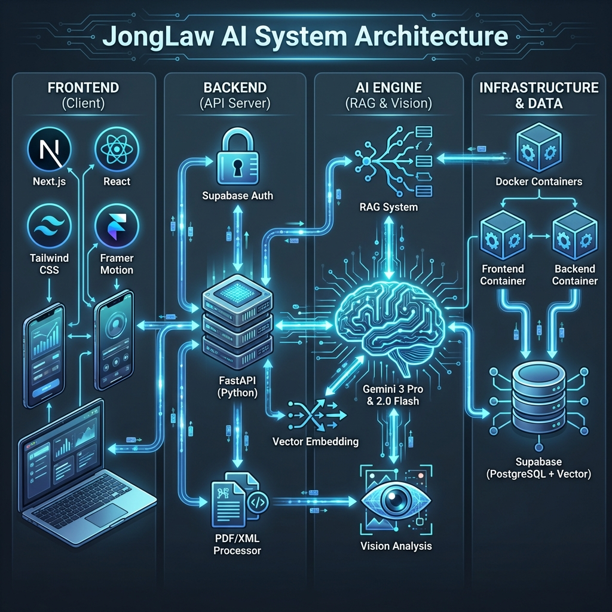
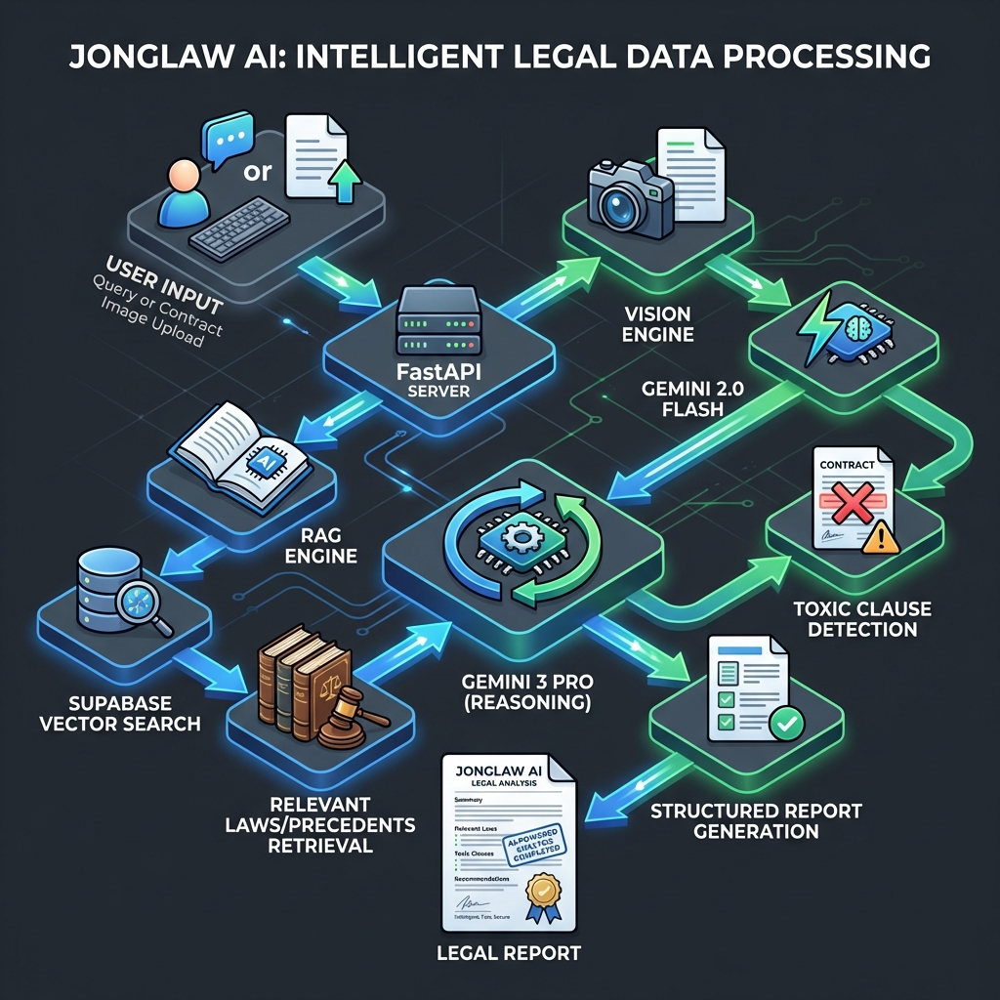
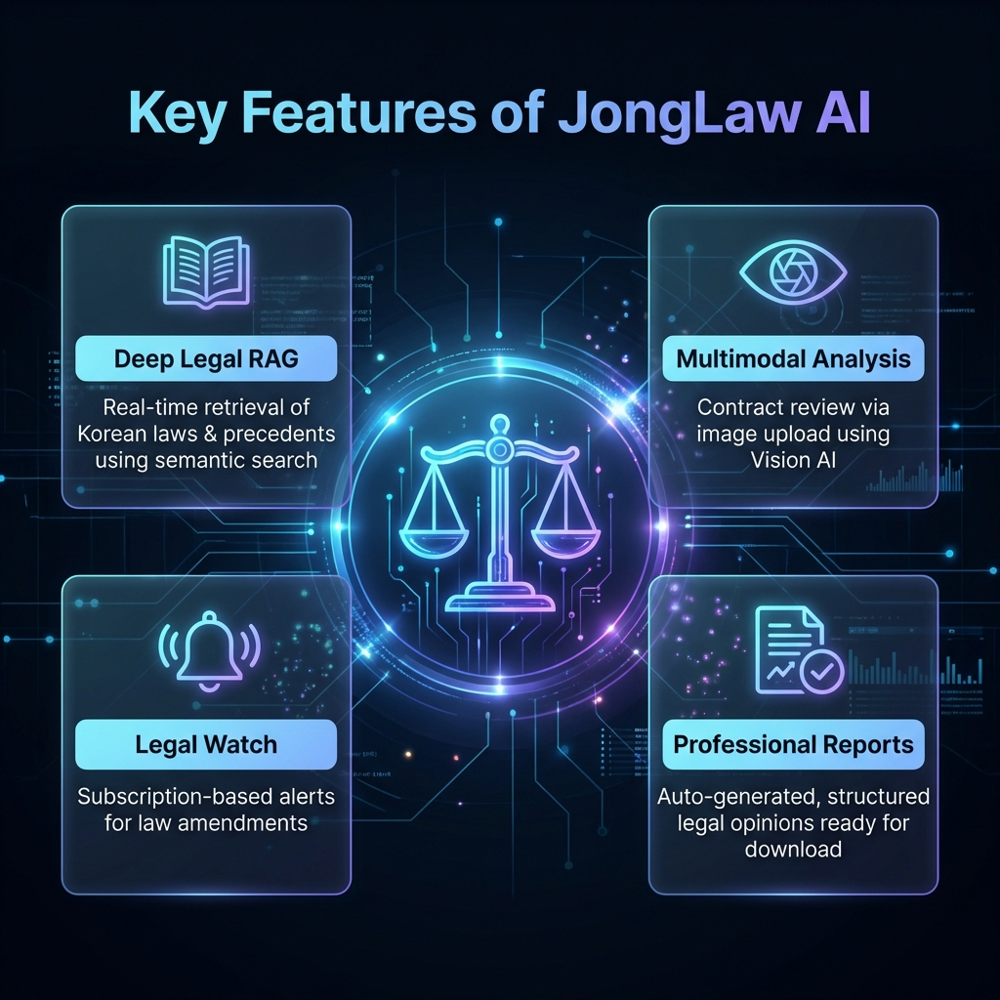
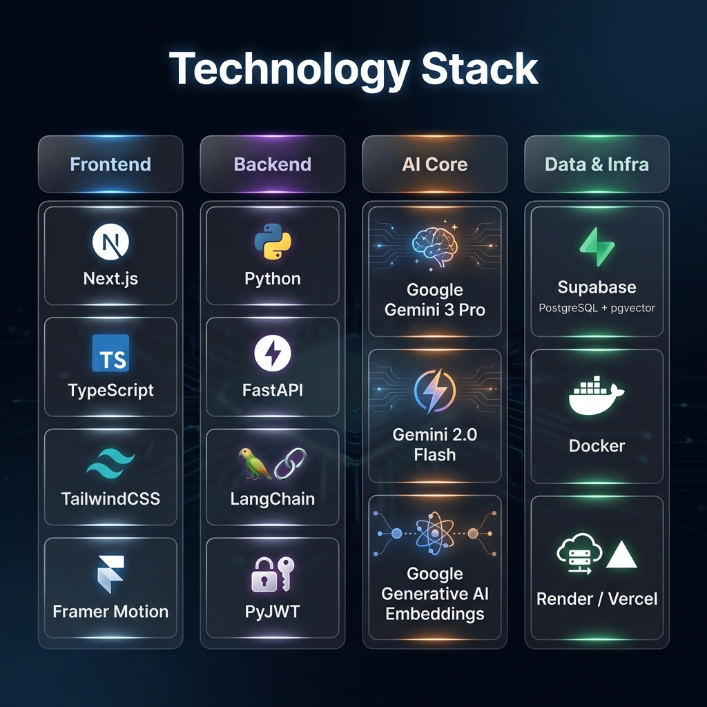

# JongLaw AI: System Architecture & Features Presentation

## 1. System Architecture Overview
This diagram illustrates the high-level architecture of the JongLaw AI system, showcasing the separation of concerns and the integration of modern technologies.

- **Frontend**: Built with **Next.js 14** and **React**, styled with **Tailwind CSS**, and interactive with **Framer Motion**.
- **Backend**: A robust **FastAPI (Python)** server handling API requests, authentication, and orchestration.
- **AI Engine**: Powered by **Google Gemini 3 Pro** for deep reasoning and **Gemini 2.0 Flash** for vision and speed.
- **Infrastructure**: Containerized with **Docker** and utilizing **Supabase** for PostgreSQL and Vector storage.

---

## 2. Intelligent Data Flow
How JongLaw AI processes user inputs to generate professional legal reports.

1. **Input**: Users provide text queries or upload contract images/PDFs.
2. **Analysis**: 
   - **Text** is processed via RAG (Retrieval-Augmented Generation) to find relevant laws and precedents.
   - **Images** are analyzed by the Vision Engine to detect toxic clauses.
3. **Synthesis**: The reasoning engine combines all context to draft a structured report.
4. **Output**: A comprehensive legal consultation report is generated.

---

## 3. Key Features
The core capabilities that define the JongLaw AI experience.

- **Deep Legal RAG**: Access to up-to-date Korean legal data.
- **Multimodal Analysis**: Review physical contracts via photos.
- **Legal Watch**: Proactive monitoring of law amendments.
- **Professional Reports**: Downloadable, verified legal documents.

---

## 4. Technology Stack
The cutting-edge tools and frameworks powering the system.

- **Frontend**: Next.js, TypeScript, TailwindCSS, Framer Motion
- **Backend**: Python, FastAPI, LangChain, PyJWT
- **AI**: Google Gemini 3 Pro, Gemini 2.0 Flash, Google Embeddings
- **Data/Infra**: Supabase (Postgres + pgvector), Docker, Render/Vercel
